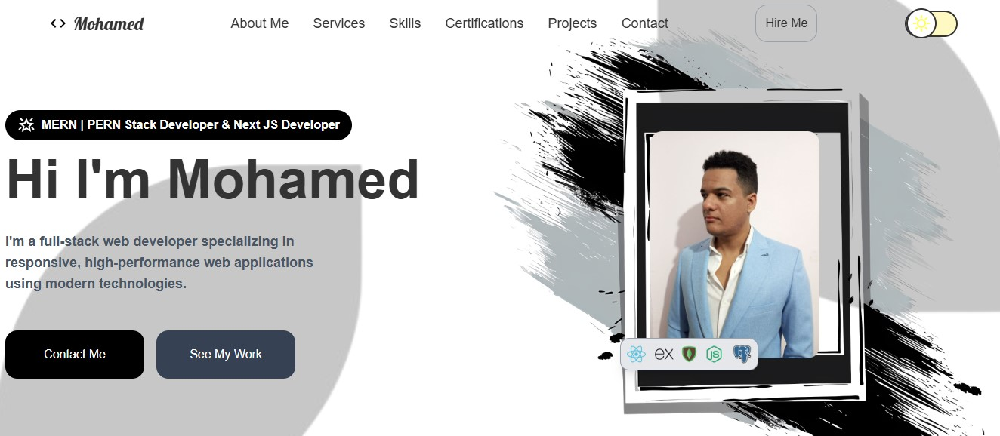

# 🌐 Personal Portfolio Website

Welcome to my personal portfolio website. This project showcases my skills, projects, and experience as a **Full‑Stack Web Developer** specializing in modern JavaScript technologies, real‑time systems, and AI‑powered applications.

🔗 **Live Website:** [https://mogabr.vercel.app](https://mogabr.vercel.app)
📦 **Repository:** [https://github.com/MO-GBR/Mohamed-Gabr-Portfolio](https://github.com/MO-GBR/Mohamed-Gabr-Portfolio)

---

# 🚀 About the Project

This portfolio was built to present my work in a clean, modern, and interactive way. It highlights my best projects, technical stack, and development journey while demonstrating my ability to build responsive and animated user interfaces.

The website is fully responsive, optimized for performance, and designed with accessibility and modern UX principles in mind.



---

# 🛠 Tech Stack

## Frontend

* **React.js**
* **Tailwind CSS**
* **GSAP** for animations

## Deployment

* **Vercel** for hosting and CI/CD

---

# ✨ Features

* Modern and responsive UI
* Smooth animations and transitions
* Projects showcase with live demos and GitHub links
* Optimized performance and fast loading
* Mobile‑first design
* Add dark/light theme toggle
* Contact form with email service

---

# 📂 Project Structure

```
portfolio/
│
├── public/            # Static assets
├── src/
│   ├── components/    # Reusable UI components
│   ├── sections/      # Page sections (Hero, Projects, Contact)
│   ├── hooks/          # Custom React hooks
│   ├── constants/        # Project and content data
│   └── redux/         # Global state management using Redux
│
└── package.json
```

---

# 🧠 What This Project Demonstrates

This portfolio is not just a static website. It demonstrates my ability to:

* Build scalable React / Next.js applications
* Design reusable component systems
* Implement advanced animations using GSAP
* Structure a real‑world production project
* Optimize performance and responsiveness
* Create Modern animated design
* Manage global states using Redux

---

# 📸 Featured Projects

The portfolio includes detailed pages for the following projects:

* **Full‑Stack E‑Commerce Platform** – Authentication, cart, payments, and admin dashboard
* **Real‑Time Chat Application** – Live messaging using WebSockets and GraphQL
* **Events Management Platform** – Event creation, management, and user interaction
* And More

Each project includes:

* Live demo
* Source code
* Technology breakdown

---

# ⚙️ Getting Started Locally

- ENV File
```env
VITE_EMAIL_SERVICE_ID=""
VITE_EMAIL_TEMPLATE_ID=""
VITE_EMAIL_PUBLIC_KEY=""
```

To run this project locally, follow these steps:

```bash
# Clone the repository
git clone https://github.com/MO-GBR/Mohamed-Gabr-Portfolio.git

# Navigate into the project folder
cd Mohamed-Gabr-Portfolio

# Install dependencies
npm install

# Start development server
npm run dev -- --port 3000
```

The application will be available at:

```
http://localhost:3000
```

---

# 📬 Contact

If you would like to collaborate, hire me, or provide feedback, feel free to reach out:

- Portfolio: [View](https://mogabr.vercel.app/)
- Email: [Contact](mailto:mohameedgabr7@gmail.com)
- LinkedIn: [View](https://www.linkedin.com/in/mohameedgabr0/)

---

# 📄 License

This project is open‑source and available under the **MIT License**.

---

⭐ If you found this project interesting, consider giving the repository a star!
